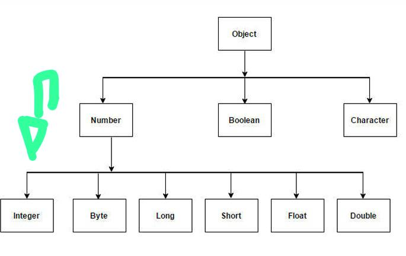

# Generics,set,map

## o que são Generics,set e map ?

1. **Generics**

Generics em Java permitem que você crie classes, interfaces e métodos que funcionam com qualquer tipo de dado, proporcionando reutilização de código com segurança de tipos. Em vez de especificar um tipo fixo, você usa um tipo genérico, representado por uma letra, como T, E, K, V etc. Quando você instancia a classe ou chama o método, você especifica qual tipo será utilizado. Isso ajuda a evitar erros de tipo em tempo de compilação e elimina a necessidade de conversões explícitas.

````Java
public class Caixa<T> {
  private T item;

  public void adicionar(T item) {
      this.item = item;
  }

  public T obter() {
      return item;
  }
}

Aqui, a classe Caixa pode armazenar qualquer tipo de objeto, garantindo que o tipo correto seja utilizado em tempo de compilação.


2. **Set**

Set é uma interface que define uma coleção que não permite elementos duplicados. O Set é ideal quando você deseja garantir que cada elemento seja único. Implementações comuns de Set incluem HashSet, LinkedHashSet, e TreeSet.

  - HashSet: Não garante a ordem dos elementos.
  - LinkedHashSet: Mantém a ordem de inserção dos elementos.
  - TreeSet: Mantém os elementos ordenados de acordo com a ordem natural ou um comparador.

```Java
Set<String> conjunto = new HashSet<>();
conjunto.add("A");
conjunto.add("B");
conjunto.add("A"); // Duplicado, não será adicionado

3. **Map**

Map é uma interface que mapeia chaves para valores. Cada chave deve ser única, mas diferentes chaves podem mapear para o mesmo valor. Map não é considerado parte das coleções do framework, mas é frequentemente utilizado em conjunto com elas.

  - HashMap: Implementação que não garante ordem.
  - LinkedHashMap: Mantém a ordem de inserção das entradas.
  - TreeMap: Mantém as chaves ordenadas de acordo com a ordem natural ou um comparador.

```Java
Map<String, Integer> mapa = new HashMap<>();
mapa.put("Alice", 25);
mapa.put("Bob", 30);
Integer idade = mapa.get("Alice"); // Retorna 25


## Tipos Coringa

Tipos coringa, representados por ?, são usados em generics quando você deseja permitir qualquer tipo, mas não se importa com o tipo específico. Existem três formas principais de usar coringas:

  - Coringa não delimitado (?): Aceita qualquer tipo.
  - Coringa delimitado superior (? extends Tipo): Aceita Tipo e suas subclasses.
  - Coringa delimitado inferior (? super Tipo): Aceita Tipo e suas superclasses.

```Java
public void imprimirLista(List<?> lista) {
  for (Object obj : lista) {
      System.out.println(obj);
    }
}

Aqui, List<?> pode ser uma lista de qualquer tipo.

## Delimitado

**Coringa Delimitado**

UM coringa delimitado é uma versão específica dos tipos coringa. Eles permitem que você especifique limites para os tipos que podem ser passados:

? extends Tipo: Garante que o tipo seja Tipo ou uma subclasse dele, o que é útil quando você deseja ler dados.


? super Tipo: Garante que o tipo seja Tipo ou uma superclasse dele, o que é útil quando você deseja adicionar dados.


Exemplo com ? extends:
```Java
public void processar(List<? extends Number> numeros) {
  for (Number num : numeros) {
      System.out.println(num);
  }
}

Exemplo com ? super:
```Java
public void adicionarNumero(List<? super Integer> lista) {
    lista.add(10);
}


** Generics Delemitado **

Generics delimitados permitem definir restrições nos tipos que podem ser usados como parâmetros genéricos. Existem dois tipos principais de limites:

Limite superior (extends): Restringe o tipo a ser uma subclasse (ou a própria classe) de um tipo específico.
Limite inferior (super): Restringe o tipo a ser uma superclasse de um tipo específico.

Exemplo com Limite Superior:

```Java
public <T extends Number> void imprimirNumeros(T numero) {
  System.out.println(numero);
}

Aqui, T pode ser Integer, Double, ou qualquer outra subclasse de Number.

Exemplo com Limite Inferior:
```Java
public void adicionarNumero(List<? super Integer> lista) {
  lista.add(10);
}

Aqui, a lista pode aceitar Integer ou qualquer superclasse de Integer, como Number ou Object.

## HashCode e equals

Em Java, hashCode e equals são métodos essenciais para comparar objetos:

equals: Verifica se dois objetos são "iguais" de acordo com a lógica definida. Se dois objetos são considerados iguais, o método equals deve retornar true.

hashCode: Retorna um valor inteiro (código hash) que representa o objeto. Esse código é usado por coleções como HashSet e HashMap para armazenar e buscar objetos de maneira eficiente.

Regra importante: Se dois objetos são iguais segundo o método equals, eles devem ter o mesmo código hash (hashCode). No entanto, objetos com o mesmo código hash não necessariamente são iguais.

Exemplo:
```Java
public class Pessoa {
    private String nome;
    private int idade;

    @Override
    public boolean equals(Object obj) {
        if (this == obj) return true;
        if (obj == null || getClass() != obj.getClass()) return false;
        Pessoa pessoa = (Pessoa) obj;
        return idade == pessoa.idade && Objects.equals(nome, pessoa.nome);
    }

    @Override
    public int hashCode() {
        return Objects.hash(nome, idade);
    }
}

Neste exemplo, equals e hashCode são sobrescritos para garantir que dois objetos Pessoa sejam comparados corretamente e armazenados de forma eficiente em coleções baseadas em hash.

## Diferença entre Set e ArrayList

A principal diferença entre Set e ArrayList em Java está em como eles tratam os elementos e as suas características principais:

1. **Duplicação de Elementos **
- Set: Não permite elementos duplicados. Se você tentar adicionar um elemento que já existe no Set, ele não será adicionado.
- ArrayList: Permite elementos duplicados. Você pode adicionar o mesmo elemento várias vezes, e cada ocorrência será armazenada.

2. **Ordem dos Elementos **
- Set: Não garante a ordem dos elementos. Dependendo da implementação, a ordem dos elementos pode ser imprevisível (HashSet), pode seguir a ordem de inserção (LinkedHashSet), ou ser ordenada de acordo com a ordem natural ou um comparador (TreeSet).
- ArrayList: Mantém a ordem dos elementos na mesma sequência em que foram adicionados.

3. **Eficiência **
- Set: É geralmente mais rápido para operações de busca e remoção quando comparado a ArrayList, especialmente em grandes coleções, porque usa um mecanismo baseado em hashing ou árvore (dependendo da implementação).
- ArrayList: Pode ser menos eficiente para busca e remoção, especialmente quando o tamanho da lista é grande, porque estas operações podem exigir que muitos elementos sejam movidos.

4. **Implementações Comuns **

- Set: Implementações incluem HashSet, LinkedHashSet, e TreeSet.
- ArrayList: ArrayList é uma das implementações da interface List.

5. **Uso Típico **

- Set: Ideal para coleções onde a unicidade dos elementos é importante, como conjuntos matemáticos ou coleções de IDs únicos.
- ArrayList: Ideal para listas ordenadas onde você pode querer acessar elementos por índice ou manter uma lista de itens que pode conter duplicatas.

**Resumo Prático: **
- Use Set quando você precisar garantir que não haja elementos duplicados e não se importar com a ordem.
- Use ArrayList quando a ordem dos elementos for importante e duplicatas forem permitidas.


````
